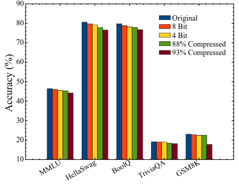

# 📝 Название статьи

**Ссылка:** [CompactifAI: Extreme Compression of Large Language Models using Quantum-Inspired Tensor Networks](https://arxiv.org/pdf/2401.14109)  
**Год:** 2024
**Статус:** [ ] Не прочитано / [x] Прочитано  
**Оценка:** ⭐️⭐️☆ (Не новая идея, деталей мало)

---

## 🔍 TL;DR

Проблема - память, чтобы сжать: веса матрица представлются в виде
$$
W_{i_1i_2\ldots i_n}^{j_1j_2\ldots j_n} = (a_{i_1}^{j_1})_{\chi_1} (a_{i_2}^{j_2})^{\chi_1}_{\chi_2} \ldots (a_{i_n}^{j_n})^{\chi_n}
$$

В работе оставлялись наиболее большие сингулярные значения.

В точном разложении $\chi_k= \min (i_kj_k \chi_{k_-1}, \prod_{l=k + 1}i_lj_l)$ -- размерность параметров увеличивается.

### Количество параметров (при одиновой размерности связи)

$\prod_k i_kj_k$ против $\chi^2 \sum_k i_k j_k$

$(ij)^n$ против $[(n - 2)\chi^2  + 2\chi] ij$

---

## 🧠 Результаты

- 📌 Снижения размеров данных (88% сжатие -- квантизация float16 ( 13 GB ~~27 GB~~) + TN (4 GB ~~13 GB~~))
- 📌 Снижения времени распределения ресурсами GPU-CPU
- 📌 Веса в разложении нужно дообучать (хилинг). Утверждается что одной эпохи было достаточно для достижения 2-3 процентов отклонения точности для LlaMA-2 (7B)
- inference time (генерация ответа) меньше на 25%

---

## 🛠️ Метод / Архитектура

- Использование СВД для разложения
- Датасеты для хилинга: Ultrachat, Alpaca и OpenHermess
- хилинг -- 8 NVIDIA A10g ...
- Бенчмарки — Понимание языка (MMLU), здравый смысл (HellaSwag), понимание прочитанного (BoolQ), знания о мире (TriviaQA) и математика (GSM8K).
- 
- 93% за счет квантизации в int4
  
## Мои вопросы

- Как растет сложность вычислений при свертке TN?
- Архитектура LlaMA?
- Каковы тонкости разложений, на как много тензоров разбиваются матрицы, какой трейд-офф (сложности вычисления -- разбитие на тензоры)
- Код?
