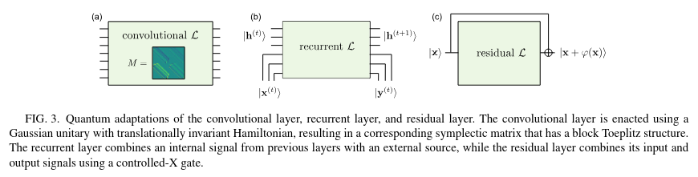
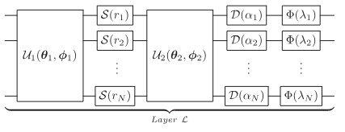

# 📝 Название статьи

**Ссылка:** [Continuous-variable quantum neural networks](https://journals.aps.org/prresearch/pdf/10.1103/PhysRevResearch.1.033063)  
**Год:** 2019  
**Статус:** [ ] Не прочитано / [x] Прочитано  
**Оценка:** ⭐️⭐️⭐️⭐️⭐️

---

## 🔍 TL;DR

Рассмотрен CV формализм, предложена PQC для света, для которой классический персептрон является частным случаем при кодирование классический параметров в квадратуры. Рассмотрены примеры CV QNN для фита функции, бинарной классификации, генерации изображений, декодирования.

---

## 🧠 Ключевые идеи

- 📌 В отличии от классический DL преобразование фазового пространства (распределения) неленийно.
- 📌 Классика — частный случай, квантовый - больший capcity
- 📌 Упомомянуто 3 типа сетей
- 
- 📌 Реккурентная для временных серий и NLP (временная трансляционная симметрия)

---

## 🛠️ Метод / Архитектура

- PQC представляет произвольное аффинное (гауссово) преобразование с последующей нелинейностью.
- 
- Представлены численные эксперименты по фиту функции, классификации, генерации изображений, декодеру.
