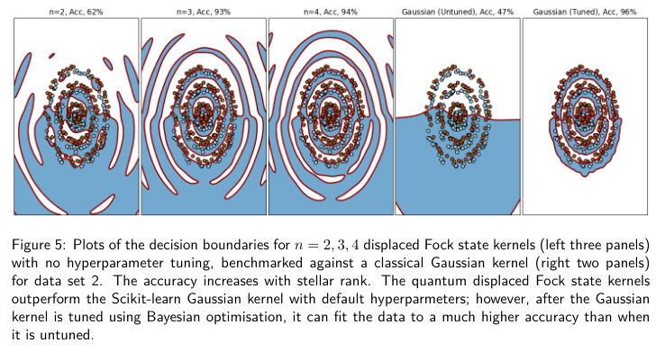

# 📝 Название статьи

**Ссылка:** [Quantum kernel machine learning with continuous variables](https://arxiv.org/pdf/2401.05647)  
**Авторы:** Henderson, Goel, Shrapnel
**Год:** 2024
**Категория:**Light + AI  
**Статус:** [ ] Не прочитано / [x] Прочитано  
**Оценка:** ⭐️⭐️⭐️⭐️☆ (по желанию)

---

## 🔍 TL;DR

Здесь, как пример, рассматривается метод опорных векторов. описывается отображение состояния на простраство голоморфных (звездных) функций:
$$
F_\psi (z) = a^{-a/2z^2 + bz + c}\sum_{j=0}^n\beta_jz^j
$$
, в котором скалярное произведение есть норма Сегала-Баргмана
$$
|| F||^2 = \frac{1}{\pi} \int d^{2m}z e^{-|z|}|F(z)|^2 
$$

n - зведный ранг, операторы рождения и уничтожения соотвествует $z$ и $\frac{d}{dz}$ (изменябт звездный ранг) 

---

## 🧠 Ключевые идеи

- 📌 нулевые значения ядра сконцетрированы вблизи 0 из-за экспоненты в скалярном произведении
- 📌 Симметрия фоков -- симметрия ядра 
- 
- кудитные состояния тоже имеют аналог в CV
- Все квантовые состояния конечного зведного ранга  могут быть построены представлены как произведение полинома на гауссову функцию в пространстве SB.

---

## 🛠️ Метод / Архитектура

- аналитически получили произведения для сдвинутых фоков
- Исследовались одномодовые сдвинутые Фоки

## Из заключения 
Затем мы доказываем, что ядра, определяемые отображениями признаков бесконечного звёздного ранга (stellar rank) — например, кодировки на состояниях ГКП — можно сколь угодно точно аппроксимировать ядрами, задаваемыми отображениями признаков конечного звёздного ранга. Далее, анализируя простой одномодовый CV-кернел, представимый как произведение гауссианы и полинома, мы формируем интуицию о том, как будут вести себя многомодовые ядра при увеличении их «квантовости», измеряемой звёздным рангом. Видно, что, вероятно, возникнут проблемы, аналогичные экспоненциальной концентрации; и хотя настройка ширины (bandwidth tuning) частично смягчает их, это создаёт компромисс между сохранением эффективного звёздного ранга и устойчивостью к статистическому шуму. Мы также показали, что возможно построить характеристические CV-квантовые ядра, обладающие одновременно трансляционной и вращательной инвариантностью; явный пример — ядро на основе сдвинутого фоковского состояния. Используя эту структуру, мы сформулировали задачу классификации аннулообразных данных и обнаружили, что такое ядро особенно хорошо подходит к задаче: точность классификации увеличивается с ростом звёздного ранга. Хотя многомодовые ядра не моделировались, ожидается схожее поведение — подавление значений ядра за порогом из-за гауссового множителя и рост звёздного ранга.
