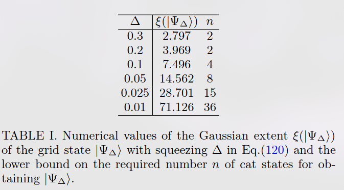

# 📝 Classical simulation and quantum resource theory of non-Gaussian optics

**Ссылка:** [https://arxiv.org/pdf/2404.07115](https://arxiv.org/pdf/2404.07115)  
**Авторы:** Oliver Hahn
**Год:** 2024
**Категория:** Light
**Статус:** Прочитано  
**Оценка:** ⭐️⭐️⭐️⭐️

---

## 🔍 TL;DR

Подобно когерентным состояниям гауссы могут служить базисом по которым можно раскладывать состояния. Так базис переполнен разложения неоднозначны, то вводится гауссов ранг и степень.
$$
\chi(|\psi\rangle) := \inf \left\{ \chi : |\psi\rangle = \sum_{k=1}^{\chi} c_k |\alpha_k, m_k\rangle \right\},
$$

$$
\xi(|\psi\rangle) := \inf \left\{ \| \mathbf{c} \|_1^2 : |\psi\rangle = \sum_k c_k |\alpha_k, m_k\rangle \right\}.
$$

На основе разложения состояний в суперпозицию гауссов приводятся два алгоритма симуляции:
- Детерминированный, сложность которого связана с рангом $\mathcal{O}(\chi^2)$
- Вероятностный, сложность которого связана с степенью $\mathcal{O}(\xi^2/\delta^2)$

---

## 🧠 Ключевые идеи

- 📌 Дано оптимальное с точки зрения минимизации степени разложения состояний фока (они имеют бесконечный гауссов ранг)
- 📌 Для котов ранг 2, но стандартные разложения не оптимальны с точки зрения степени
- 📌 Гауссов ранг при измерениях не увеличивается, пример числа ресурсных котов для генерации сенсорных состояний

---

<!-- ## 🛠️ Метод / Архитектура

- Описание используемого подхода, модели, алгоритма
- Что нового/отличительного?
- Есть ли схемы или архитектуры? -->