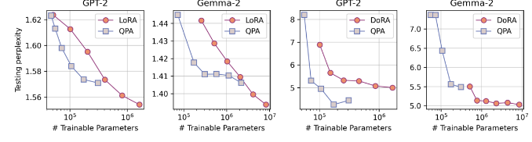
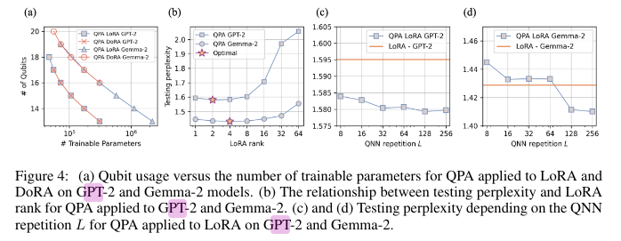

# 📝 Название статьи

**Ссылка:** [A QUANTUM CIRCUIT-BASED COMPRESSION PERSPECTIVE FOR PARAMETER-EFFICIENT LEARNING](https://arxiv.org/pdf/2410.09846)  
**Год:** 2025
**Статус:** [ ] Не прочитано / [x] Прочитано  
**Оценка:** ⭐️⭐️⭐️☆ (Много подробностей, небольшие масштабы)

---

## 🔍 TL;DR

Проблема – кодирование больших датасетов. Quantum Parameter Adaption. PQC -- генерирует параметры для fine tuning, что позволяет снизить число обучаемых параметров. **Квантовая часть используется только в обучении.**. Пример в LoRA:
$$
\Delta W = AB
$$

Параметры A и B  генерируется с помощью измерения наблюдаемых.

---

## 🧠 Ключевые идеи

- 📌 Метод основан на гипотезе о том, что гильбертово пространство высокой размерности позволяет эффективно представлять информацию для адаптации. Почему это так?
- существует оптимальная соотношения LoRA ранга и perplexity
- при обучение не наблюдалась экспоненциальное исчезновение градиента (небольшое число кубитов)

---

## 🛠️ Метод / Архитектура

- измеряются амплитуды вероятности всех состояний базиса, которые сопоставляеются параметрам.
- Кол-во кубитов уменьшается разбиением параметров на чанки. Таким образом получается несколько PQC (n/nch), результаты которых перепутывются параметризованными персептронами.
- меньше кубитов больше параметров
- 
- выложили параметры обучения, времени и тд
  
---

## Мои вопросы

- Амплитуды вероятности должны быть распределены по портеру-томасу, снова избыточная параметризация?.. В экспериментах исопльзовалось их не большое число.

## Ссылки

- [Prefix tuning](https://arxiv.org/pdf/2101.00190)
