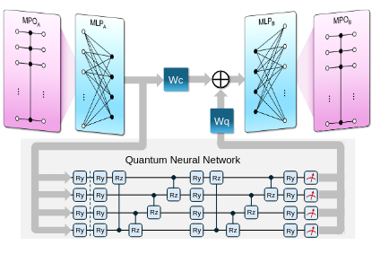
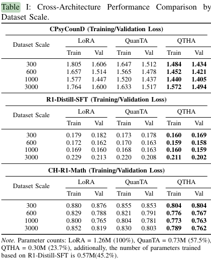
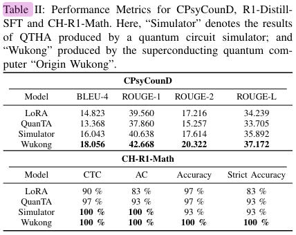

# 📝 Название статьи

**Ссылка:** [Quantum-Enhanced LLM Efficient Fine Tuning](https://arxiv.org/pdf/2503.12790v2)  
**Год:** 27.05.2025  
**Категория:** AI / Light / Light + AI  
**Статус:** [ ] Не прочитано / [x] Прочитано  
**Оценка:** ⭐️⭐️⭐️⭐️☆ (подозрительно)

---

## 🔍 TL;DR

LoRA -- поправка к pretune:
$$
 \Delta M_i^j = A^j_{\chi}  B^{\chi}_{j}
$$
Насколько я понял в работе (индексы – не матрицы, а размерности входа выхода):
$$
    \Delta M_i^j = MPO^j_{j'} \circ MLP^{j'}_{\chi_1} \circ CQC^
    {\chi_1}_{\chi_2} \circ MLP_{i'}^{\chi_2} \circ MPO^{i'}_{i}
$$
Выход $O_c$ подается после angle embedding на квантовую запутывающую схему. $O_q$ — мат ожидания $Z_i$
$$
CQC(O_c) = w_c O_c + w_q O_q
$$

Таким образом, по сравнению с LoRA добавляются нелинейнности от слоев персептронов и квантовой схемы. Левая правая части являются аналогами A, B.

Приводятся результаты эксперимента на Вуконге (сверхпроводник 70 кубитов)

---

## 🧠 Ключевые идеи

- 📌 O_A сохраняет классику, O_B улавливает нелинейные отношейний [1-3]
- Можно избежать непосредственно эмбединга qc в алгоритм
- Внутренний случайный шум в квантовых системах (например, декогеренция и ошибки при выполнении гейтов) может способствовать повышению устойчивости рассуждений за счёт следующих механизмов: в матрице вероятностей, выдаваемой LLM, только в том случае, когда вероятность ключевого токена превышает заданный порог, он существенно влияет на принятие решения. Это означает, что незначительные возмущения, вносимые шумом, могут быть отфильтрованы этими порогами, тем самым сохраняя стабильность результата. Вероятностная природа квантовых систем (например, коллапс суперпозиционного состояния) и вероятностный вывод LLM имеют математические сходства, и шум может неявно откалибровать распределение вероятностей, улучшая согласованность рассуждений.

---

## 🛠️ Метод / Архитектура

- Датасеты: CPsyCoun – психология, R1-Distill-SFT – математика, Chinese-DeepSeek-R1-Distill-data-110k
- Бенчмарки:
  1) Кросс-энтропийная потеря для классификации:
    $$
    L = -\frac{1}{N} \sum_{i=1}^{N}\sum_{k=1}^Cy_{ik} log(p_{ik})
    $$
  2) Perplexity -- метрика для NLM, определяет неопределенность при выборе следующего токена:
   $$
   PPL = \exp\left(-\frac{1}{N}\sum_{i=1}^N \log P(w_i|w_{<i})\right)
    $$
  3) BLEU-4, ROUGE -- лексическая точность. Совпадение сгенерированного и референсного текстов.
- Инициализация MPO весов, метод Кайминга [4]
- Так как обучения происходит по батчам, а в квантовой цепи помещается только 1 вектор, то каждый батч запутывается с параметрами... (бред какой-то)

---

## Мои вопросы

- Почему симуляция хуже эксперимента?..
- Судя по циферкам на 30 промтах проверяли (может быть подгоном под вуконга)
- 
- Есть ли что-то похожее без добавления QC?

## Ссылки

[1] [The power of quantum neural networks, 2021](https://arxiv.org/pdf/2011.00027)  
[2] [Quantum machine learning in feature hilbert spaces,2019](https://arxiv.org/pdf/1803.07128)  
[3] [Quantum neural network for quantum neural computing, 2023](https://arxiv.org/pdf/2305.08544)  
[4] [Surpassing human-level performance on imagenet classification](https://arxiv.org/pdf/1502.01852)